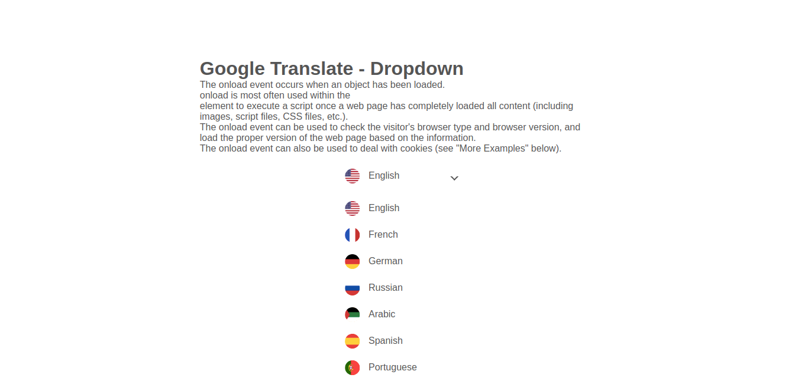
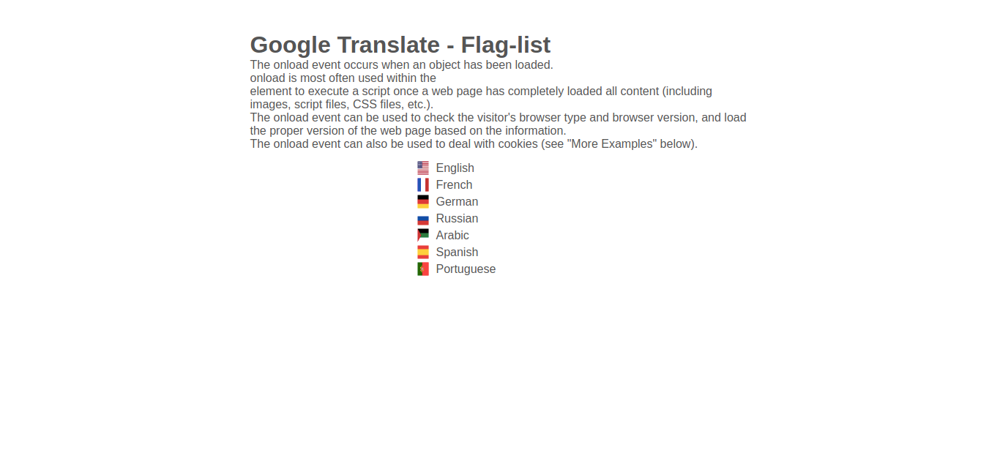
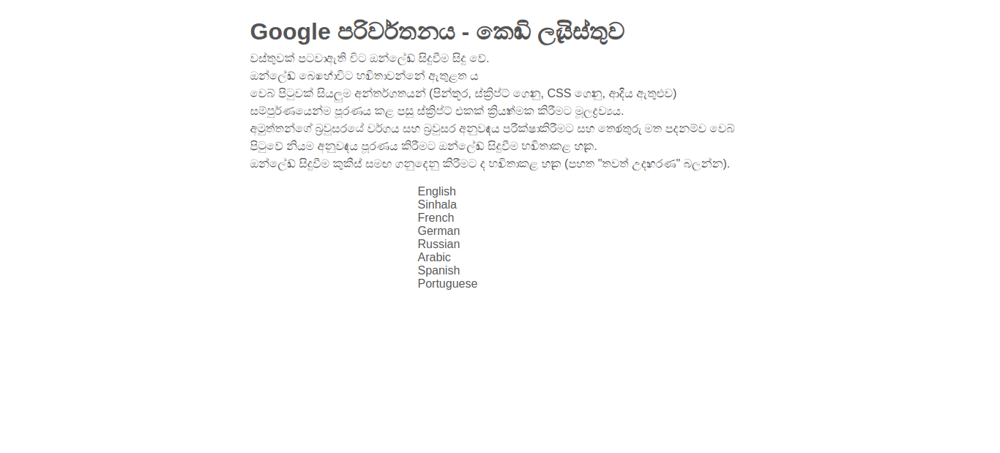

# Google Translator - With Flags #

A simple translator package using the google translater. Converts the whole website to your desired language, with multiple output formats.

1. [Dropdown Translate](./drop-down.html)
2. [Flag-list Translate](./flag-list.html)
3. [Text Translate](./text.html)

## Dropdown Translate

## Flag-list Translate

## Text Translate

